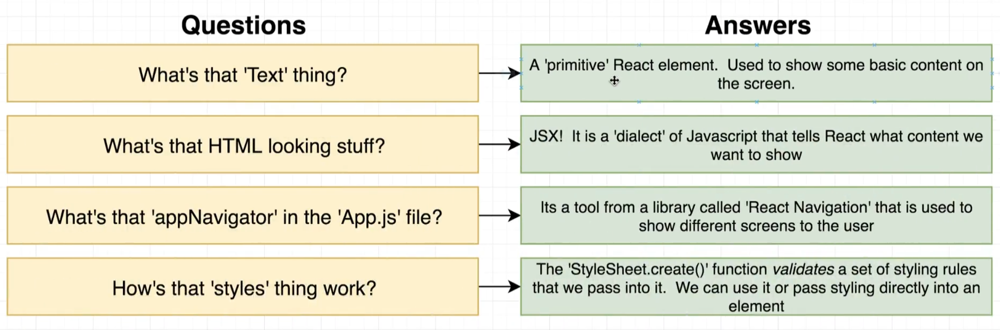

# react-native

* Author's repo: https://github.com/StephenGrider/redux-code
* https://app.diagrams.net/#Hnuthanc%2Frn-casts%2Fmaster%2Fdiagrams%2F07%2Fdiagrams.xml
### Overview

* Write code
  * Test on a physical device: Easiest to setup
  * Test on a fake device: Changes to code show up faster

### App Setup

```sh
cd rn-starter
npm install
npm start
```
* Install **expo** on your phone from Google Play Store
* Scan the QR code from the React Native Bundler on your phone
* If **LAN connection doesn't work, switch to Tunnel** and scan again 
* Add ComponentsScreen file
* 4 things to do in a Component
  * Import libraries required to create a Component
  * Create a Component: a function that returns some JSX
  * Create a Stylesheet to style our component
  * Export the Component

### Showing a Custom Component

* In App.js, import and provide ComponentsScreen as an option to createStackNavigator

### Common Question and Answers


* Primitive elements
  * Text
  * View: Element for grouping other elements or stylings
  * Image
  * Button
* StyleSheet.create is not required to create styles, but it is used for additional validation it provides
```js
<Text style={{fontSize: 30}}>Hi There!</Text>

// The below gives a warning instead of big Error as seen from StyleSheet.create
<Text style={{fontsize: 30}}>Hi There!</Text>
```

### Rules of JSX

* We can assemble different JSX elements like normal HTML
  * Use View element to position or group multiple elements within it
* We configure different JSX elements using props
* We can refer to JS variables inside of a JSX block by using curly braces
  * Cannot show JS object inside of Text element
* We can assing JSX elements to a variable, then show that variable inside of a JSX block

### One Common Error

* After return immediately ( or the JSX element not in the next line
* If it's in the next line, it is considered as return; and we get an Error